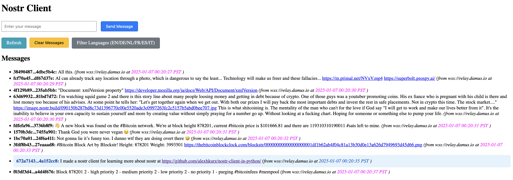

# Nostr Client in Python

This is a simple Nostr client in Python that connects to a relay and allows you to send and receive events.

WARNING: Work in progress. Intended as a teaching and learning project, not for production use or deployment.



## Installation, Setup, Usage

```
source setup.sh
```

To generate a new key pair, run
```
python generate_keys.py
```
The keys will be saved to `config.json`.

To run the client from the command line, use
```
python nostr_client.py
```

To run it in a web browser, use
```
python app.py
```

## Background

- [NIP-01](https://github.com/nostr-protocol/nips/blob/master/01.md)
- [The NOSTR protocol](https://nostradamic.com/notes-and-other-stuff-transmitted-by-relays/the-nostr-protocol)


## Specification

`class NostrClient:`

> `self.potential_relays` is a list of potential relays to connect to.
> 
> `self.relay_url` is the URL of the relay we are currently connected to.

> `fetch_relays()` attempts to connect to each relay in `self.potential_relays` and checks if the connection is successful.
> 
> `send_message(message)` sends `message` to the relay.
> 
> `read_messages()` reads messages from the relay.
> 
> `check_relay(url)` checks if the url is alive by attempting to connect to it.
> 
> `connect()` attempts to connect to the relay for sending and receiving messages.

`app.py` provides a web interface to the Nostr client.

